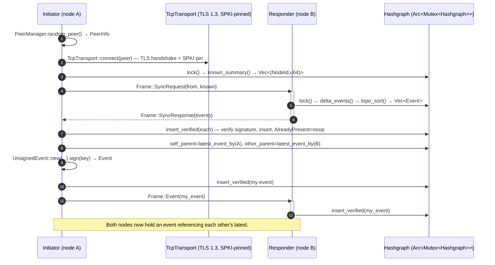

# Architecture

This document maps the JKain codebase — crate by crate, struct by struct — and
walks one full gossip sync round end to end, so the flow from "event arrives
on the wire" to "I create my own event" is visible with the real types at
every step.

## 1. Crate stack

```
┌─────────────────────────────────────────────────────────────────┐
│  gossip  (protocol/gossip)         NETWORK LAYER                 │
│  GossipNode · PeerInfo · PeerManager · TlsIdentity ·            │
│  TcpTransport · Frame · SyncRequest/SyncResponse ·              │
│  ReconnectRequest/Response · SyncTiming                          │
└──────────────────────────┬──────────────────────────────────────┘
                            │ depends on
┌──────────────────────────▼──────────────────────────────────────┐
│  consensus (protocol/consensus)   CONSENSUS / ORDERING          │
│  Hashgraph · EventRecord · SignedCheckpoint · CheckpointPayload │
│  CheckpointSig · CheckpointAccumulator · RetainedEvent          │
│  RosterHistory · Ancestry (see/stronglySee)                     │
└──────────────────────────┬──────────────────────────────────────┘
                            │ depends on
┌──────────────────────────▼──────────────────────────────────────┐
│  storage (protocol/storage)       DURABLE EVENT LOG             │
│  EventLog · EventSink · atomic::atomic_write                    │
│  stream  (protocol/stream)        MIRROR STREAM FILES           │
│  EventStreamWriter · RecordStreamWriter · running_hash          │
│  state   (executor/state)        DETERMINISTIC EXECUTOR        │
│  State · StateDb · SparseMerkleTree · Executor · DidOp          │
└──────────────────────────┬──────────────────────────────────────┘
                            │ depends on
┌──────────────────────────▼──────────────────────────────────────┐
│  crypto (protocol/crypto)          SIGNING / MEMBERSHIP         │
│  MembershipRegistry · RosterHistory · MembershipOp · Signable  │
│  Verifiable · Hashable · CanonicalEncode                        │
└──────────────────────────┬──────────────────────────────────────┘
                            │ depends on
┌──────────────────────────▼──────────────────────────────────────┐
│  primitives (protocol/primitives)    CORE VALUE TYPES           │
│  Event · UnsignedEvent · EventHash · NodeId · Timestamp ·       │
│  Signature · Transaction                                         │
└─────────────────────────────────────────────────────────────────┘
  test-support (protocol/test-support) — shared test timing, no prod deps
```

Rule of thumb: `primitives` is the vocabulary, `crypto` signs and verifies
it, `consensus` stores and orders it, `storage`/`stream`/`state` persist it,
`gossip` moves it across the network. `node` (the `jkaind` daemon) wires
all of the above to the filesystem and process lifecycle.

## 2. The core data structures

### 2.1 The atom: `Event` (`protocol/primitives/src/event.rs`)

```rust
pub struct UnsignedEvent {
    creator: NodeId,                        // u64 wrapper
    self_parent: Option<EventHash>,         // [u8; 32] wrapper — my last event
    other_parent: Option<EventHash>,        // [u8; 32] wrapper — peer's last event
    timestamp: Timestamp,                   // u64 wrapper
    payload: Vec<Transaction>,              // Vec<u8> wrappers
}

pub struct Event {
    unsigned: UnsignedEvent,
    signature: Signature,                   // Ed25519 over the unsigned part
}
```

The two parents are what make it gossip: `self_parent` chains a creator's own
history, `other_parent` ties two nodes' histories together whenever they sync.

### 2.2 Stored form: `EventRecord` (`protocol/consensus/src/hashgraph.rs:45`)

```rust
pub struct EventRecord {
    event: Event,
    seq: u64,                              // creator's sequence counter
    ancestor_seqs: Vec<u64>,               // width = #members; slot i = highest
                                           //   seq from member i among ancestors
    round: u64,                            // birth round (Spec §2)
    is_witness: bool,                      // first event of its creator in round
    votes: HashMap<EventHash, bool>,       // fame votes, witnesses only (§3)
    fame_status: FameStatus,               // Undecided / Famous / NotFamous
    round_received: Option<u64>,           // final order (§4)
    consensus_timestamp: Option<Timestamp>,
}
```

### 2.3 The store: `Hashgraph` (`protocol/consensus/src/hashgraph.rs:151`)

```rust
pub struct Hashgraph {
    events: HashMap<EventHash, EventRecord>,          // the store
    children: HashMap<EventHash, Vec<EventHash>>,     // reverse edges
    latest_by_creator: HashMap<NodeId, EventHash>,    // O(1) per-creator frontier
    by_creator_seq: HashMap<(NodeId, u64), EventHash>,
    first_child: HashMap<(NodeId, Option<EventHash>), EventHash>,  // fork detection
    member_index: HashMap<NodeId, usize>,
    member_count: usize,
    roster_history: RosterHistory,                    // per-round membership
    known_forkers: Vec<bool>,
    witnesses_by_round: HashMap<u64, Vec<EventHash>>,
    undecided_witnesses: HashMap<EventHash, u64>,
    highest_witness_round: u64,
    fully_decided_rounds: BTreeSet<u64>,
    next_round_to_order: u64,
}
```

A `GossipNode` owns one of these behind `Arc<Mutex<Hashgraph>>`
(`protocol/gossip/src/node.rs:93`): `Arc` so both the sync driver and every
inbound connection task can reach the same graph, `Mutex` (tokio) so their
concurrent reads and writes are safe.

### 2.4 The wire vocabulary: `Frame` (`protocol/gossip/src/proto.rs:96`)

| Variant | Tag | Direction | Payload |
|---|---|---|---|
| `SyncRequest(SyncRequest)` | `0x00` | initiator → responder | `{ from: NodeId, known: Vec<(NodeId, u64)> }` |
| `SyncResponse(SyncResponse)` | `0x01` | responder → initiator | `{ events: Vec<Event> }` (topo-sorted) |
| `Event(Event)` | `0x02` | either → either | one signed event |
| `CheckpointSig(CheckpointSig)` | `0x03` | either → either | one round signature |
| `Reconnect(ReconnectRequest)` | `0x04` | learner → teacher | `{ from: NodeId }` (reconnect port) |
| `ReconnectResponse(...)` | `0x05` | teacher → learner | checkpoint + state + retained graph |
| `Behind` | `0x06` | responder → initiator | requester is behind pruned history |

Every frame on the wire is `[tag: u8][payload_len: u32 BE][payload]`. The
payload for request/response frames is the canonical encoding, so both sides
serialize byte-for-byte identically.

## 3. Sequence diagram — one gossip sync round

### 3.1 ASCII

```
┌──────────┐                      TLS (SPKI-pinned, TCP)                ┌──────────┐
│ INITIATOR│                                                             │ RESPONDER│
│ (node A) │                                                             │ (node B) │
└──────────┘                                                             └──────────┘
     │                                                                        │
     │ peers.lock() → PeerManager.random_peer() → PeerInfo                    │
     │ outbound.entry(node_id) → TcpTransport (reuse or connect)              │
     │   connect → TcpStream::connect(peer.addr)                              │
     │          → TlsConnector (FingerprintVerifier vs spki_fingerprint)      │
     │                                                                        │
     │  hashgraph.lock()                                                      │
     │  known_summary(&hg, &registry)                                         │
     │    → per member: latest_event_by → get → record.seq                    │
     │    → Vec<(NodeId, u64)>                                                │
     │                                                                        │
     │── SyncRequest{ from:A, known } ────────────────────────────────────────▶│
     │                                                                        │
     │                                                                        │  hashgraph.lock()
     │                                                                        │  delta_events(&hg, &known)
     │                                                                        │    → walk self_parent chains above frontier
     │                                                                        │    → topo_sort (Kahn) parents-first
     │                                                                        │    → Vec<Event>
     │                                                                        │
     │◀──────────────────────────── SyncResponse{ events } ───────────────────┤
     │                                                                        │
     │  for event in events:                                                  │
     │    insert_verified(&hg, &registry, event)                              │
     │      → event.verify(&registry)   (Ed25519)                             │
     │      → hashgraph.insert(VerifiedEvent)                                 │
     │          AlreadyPresent? → no-op (benign, redundant syncs)             │
     │          MissingParent?  → Err → needs_reconnect = true                │
     │          else → EventRecord built, stored, round/fame machinery runs   │
     │                                                                        │
     │  self_parent  = latest_event_by(&A)                                    │
     │  other_parent = latest_event_by(&B)                                    │
     │  event = UnsignedEvent::new(A, self_parent, other_parent, ts, payload) │
     │          .sign(&signing_key)                                           │
     │  insert_verified(&hg, &registry, event)   ← my own event is stored     │
     │                                                                        │
     │── Frame::Event(my_event) ─────────────────────────────────────────────▶│
     │                                                                        │  insert_verified(&hg, &registry, event)
     │                                                                        │  → same verify + insert path
     │                                                                        │  → now BOTH hold an event referencing
     │                                                                        │    each other → gossip has spread
     │                                                                        │
     │  process_finalized_rounds()  (after each round, both sides)            │
     │    → finalized events executed → per-round state hash captured         │
     │    → membership ops (MembershipOp::Add) activated                      │
     │    → produce_checkpoint + gossip_checkpoint_sigs (Frame::CheckpointSig)│
```

### 3.2 Mermaid (renders on GitHub)



## 4. What happens after gossip — finalization (both sides)

The sync driver calls `GossipNode::process_finalized_rounds()`
(`protocol/gossip/src/node.rs:425`) after every round. It runs in phases:

- **A** — collect newly finalized `(Event, round_received)` pairs under the
  hashgraph lock alone.
- **B** — bucket them by round, execute one round at a time, and capture the
  deterministic `state::State::to_bytes()` + SHA-256 per round (this is what
  makes every node compute the *same* `state_hash` for a round).
- **C** — activate `MembershipOp::Add` ops whose activation round
  (`roundReceived + 1`) is fully decided: grow the hashgraph, register the
  key, and add the peer via `PeerManager::add_peer_from_key` (TLS pin derived
  from the Ed25519 key).
- **D** — produce a signed checkpoint per newly decided round
  (`produce_checkpoint`); when >2/3 of members' signatures accumulate in a
  `CheckpointAccumulator`, accept it (`accept_checkpoint`) and prune history
  below `round - RETENTION_ROUNDS`.

## 5. Scaling — gossip and execution (design locked)

Scaling to 100/1,000 nodes is tracked in `../docs/OPTIMIZATION.md` (2026-08-20).
At a high level:

* **Gossip track:** `QUIC + dynamic smart peer selection + bounded concurrent
  fanout`. `SyncTransport` stays abstract so `TcpTransport`
  (`protocol/gossip/src/transport.rs:46`) remains as benchmark/fallback.
  Active QUIC pool 10–30, scored selection (frontier usefulness, success EWMA,
  latency, freshness, diversity, recent-selection penalty, failure/backoff),
  adaptive fanout/interval with hard bounds, persistent QUIC for hot peers /
  resumption for cold, topology-aware diversity, gossip scheduling detached
  from `Hashgraph` processing. Sequence `G0 instrument → G1 QUIC → G2
  concurrent fanout → G3 scoring → G4 adaptive → G5 compression/batching →
  G6 100/500/1,000-node bench`.
* **Execution track:** optional `access_list` + serial fallback (typed
  `AccessKey` domains `Account/HtsToken/HcsTopic/ContractStorage/StateKey/
  Unknown`), deterministic dependency scheduler (`Levels` via Kahn, tie-break
  by `consensus_order`), `State A (serial oracle) == State B (parallel plan)`
  invariant before real concurrency, versioned snapshot + deterministic commit
  in `consensus_order`, batched Merkle/Fjall, then MVCC/sharding and pipeline
  decoupling. Bounds converge at `state::finalized_events(&hg)` →
  `process_finalized_rounds`.

Current code below describes the pre-scaling baseline; see `../docs/OPTIMIZATION.md`
for the post-scaling target.

## 6. Recovery paths

- **Durable event log (primary, Phase 8)** — every verified event is
  appended to `<data>/eventlog/` (Fjall, `protocol/storage`) on insertion and
  `roundReceived` is recorded as ordering completes. A restarting node replays
  the log via `node::restart::latest_for_restart_with_log`, verifying each
  event against the roster active at its birth round (from the persisted
  `RosterHistory`), and restores the timestamp watermark as
  `max(persisted watermark, newest retained own-event)`. No peer required;
  `request_reconnect()` is only the fallback when the log is empty
  (pre-Phase-8 data dir).
- **`Frame::Behind` or `MissingParent` (fallback)** → the node is behind its
  peers' pruned history; `needs_reconnect` is set, and next interval it calls
  `fetch_checkpoint` against a peer's dedicated reconnect port
  (`protocol/gossip/src/reconnect.rs`). The teacher serves the highest
  accepted `SignedCheckpoint` plus the raw state bytes, roster history,
  retained graph, and `last_timestamp` watermark; `verify_signed_checkpoint`
  enforces the `>2/3` quorum proof (`valid * 3 > total * 2`) before anything
  is applied.
- **`GossipNode::from_checkpoint`** bootstraps a node directly from a served
  checkpoint instead of replaying history from genesis; `apply_checkpoint`
  validates the state hash (Merkle root via `State::root()`), roster, and
  this node's own key before loading. The state snapshot lives in the
  `StateDb` `snap` keyspace, verified non-destructively over a temp DB.
- **Monotonic timestamps** — `GossipNode::next_timestamp` clamps
  `SystemTime` against the per-node `last_timestamp` (AtomicU64) so wall-clock
  regression or coarse resolution (Windows 15.6 ms) cannot emit equal or
  decreasing timestamps. The watermark is persisted per checkpoint and
  fsync'd via `atomic::atomic_write` (temp + `sync_all` + rename + dir
  fsync).
